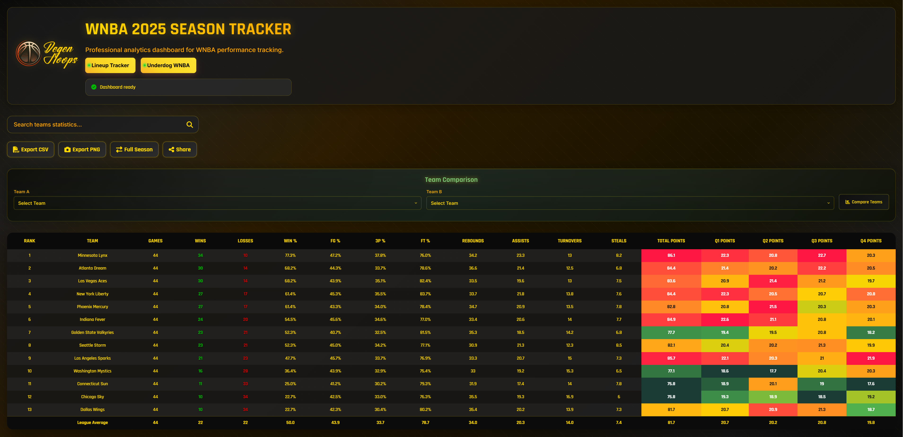

# WNBA Season Tracker Dashboard

<div align="center">



**A professional analytics dashboard for tracking WNBA team performance with interactive visualizations and advanced statistical analysis.**

[](https://github.com/degenhoops/wnba-season-tracker)
[](LICENSE)
[](https://developer.mozilla.org/en-US/docs/Web/JavaScript)

[View Demo](#-demo) • [Features](#-features) • [Quick Start](#-quick-start) • [Documentation](#-usage)

</div>

---

## 🎯 What is This?

The WNBA Season Tracker Dashboard is a comprehensive web application designed for basketball enthusiasts, analysts, and coaches who want to dive deep into team performance data. Built with vanilla JavaScript and modern web technologies, it transforms raw statistical data into actionable insights through beautiful, interactive visualizations.

Whether you're comparing teams, tracking season trends, or analyzing recent performance, this dashboard provides professional-grade analytics tools that are both powerful and easy to use.

## ✨ Key Features

### 📊 **Interactive Data Tables**
- **Sortable columns** - Click any header to sort ascending/descending
- **Smart search** - Real-time filtering across all team statistics
- **Heatmap visualization** - Color-coded cells highlight top and bottom performers
- **Responsive design** - Horizontal scrolling on mobile, full tables on desktop

### 📈 **Dynamic Charts & Visualizations**
- **Quarter-by-quarter performance** - Stacked bar charts showing scoring distribution
- **Performance trends** - Scatter plots correlating win percentage with points scored
- **Radar charts** - Multi-dimensional team comparisons at a glance
- **Powered by Chart.js** - Smooth animations and interactive tooltips

### ⚖️ **Advanced Team Comparison**
- **Side-by-side analytics** - Compare any two teams across 15+ metrics
- **Offensive/Defensive ratings** - Calculate efficiency metrics automatically
- **Momentum tracking** - Analyze performance trends over recent games
- **AI-powered insights** - Get strategic recommendations based on statistical advantages
- **Strengths & weaknesses** - Automated analysis of team capabilities

### 💾 **Data Export Capabilities**
- **CSV export** - Download tables for Excel or Google Sheets
- **PNG export** - Save visualizations as high-quality images
- **One-click downloads** - Export current view instantly

### 🎨 **Modern User Experience**
- **Dark theme** - Easy on the eyes with gold and orange accents inspired by basketball
- **Smooth animations** - Polished transitions and micro-interactions
- **Mobile-first design** - Fully responsive from 320px to 4K displays
- **Accessibility** - Keyboard navigation and screen reader support

## 🎬 Demo

### Main Dashboard
The dashboard provides an at-a-glance view of all team statistics with intelligent heatmapping and instant search capabilities.

### Team Comparison Tool
Compare any two teams with detailed breakdowns including radar charts, efficiency ratings, and strategic insights.

### Quarter Performance Analysis
Visualize how teams perform across all four quarters with interactive stacked bar charts.

## 🚀 Quick Start

### Prerequisites

You only need:
- A modern web browser (Chrome, Firefox, Safari, or Edge)
- A local web server (Python, Node.js, PHP, or any HTTP server)

### Installation

1. **Clone or download this repository**
   ```bash
   git clone https://github.com/degenhoops/wnba-season-tracker.git
   cd wnba-season-tracker
   ```

2. **Verify you have all required files**
   ```
   wnba-season-tracker/
   ├── index.html          # Main dashboard page
   ├── app.js             # Core application logic
   ├── style.css          # Styles and themes
   ├── fullseason.json    # Full season statistics
   ├── lastfive.json      # Recent games statistics
   ├── teams.json         # Advanced analytics (optional)
   ├── logo.png           # Your team/brand logo (optional)
   └── preview.png        # Dashboard preview image
   ```

3. **Start a local web server**

   Choose the method that works for your environment:

   **Python 3 (Recommended):**
   ```bash
   python -m http.server 8000
   ```

   **Node.js:**
   ```bash
   npx http-server -p 8000
   ```

   **PHP:**
   ```bash
   php -S localhost:8000
   ```

4. **Open your browser**
   
   Navigate to: `http://localhost:8000`

That's it! The dashboard should load with your data.

## 📊 Data Format Guide

### Full Season & Last 5 Games Data

Your `fullseason.json` and `lastfive.json` should follow this structure:

```json
[
  {
    "RANK": 1,
    "TEAM NAME": "New York Liberty",
    "GAMES": 40,
    "WINS": 34,
    "LOSSES": 6,
    "WIN %": 85.0,
    "FG%": 46.5,
    "3P%": 36.2,
    "FT%": 82.1,
    "REBOUNDS": 35.8,
    "ASSISTS": 21.4,
    "TURNOVERS": 12.3,
    "STEALS": 8.1,
    "BLOCKS": 4.2,
    "TOTAL POINTS": 91.5,
    "Q1 POINTS": 22.8,
    "Q2 POINTS": 23.1,
    "Q3 POINTS": 23.5,
    "Q4 POINTS": 22.1
  }
]
```

### Advanced Analytics (Optional)

For enhanced comparison features, add a `teams.json` file:

```json
[
  {
    "name": "New York Liberty",
    "stats": {
      "off_rtg": 112.5,
      "def_rtg": 98.2,
      "net_rtg": 14.3,
      "ast_pct": 64.2,
      "reb_pct": 52.1,
      "tov_pct": 12.8,
      "efg_pct": 52.3,
      "opp_pts": 85.4
    },
    "notes": {
      "strengths": "Elite offensive efficiency with strong ball movement. Dominant defensive presence.",
      "weaknesses": "Inconsistent three-point shooting in clutch situations."
    }
  }
]
```

## 🎮 Usage

### Viewing and Sorting Data

1. **Switch between datasets** using the toggle buttons at the top
   - "Full Season" - Complete season statistics
   - "Last 5 Games" - Recent performance trends

2. **Sort any column** by clicking the column header
   - First click: ascending order
   - Second click: descending order
   - Visual arrow indicators show current sort

3. **Search for teams** using the search bar
   - Filters in real-time as you type
   - Searches across all columns

### Comparing Teams

1. Navigate to the **Team Comparison** section
2. Select your first team from the dropdown
3. Select a second team to compare against
4. Click **"Compare Teams"**

You'll see:
- Overall efficiency ratings (offensive, defensive, net)
- Visual radar chart comparison
- Statistical advantages highlighted
- Strengths and weaknesses analysis
- Momentum trends
- Strategic insights and recommendations

### Viewing Charts

- **Toggle chart types** using the buttons above the visualization
  - Quarter Performance: See scoring distribution by quarter
  - Performance Trends: Analyze win percentage vs total points

### Exporting Data

- **Export as CSV**: Click to download table data for spreadsheet analysis
- **Export as PNG**: Click to save the current view as an image

## ⚙️ Configuration

Customize the dashboard by editing `CONFIG` in `app.js`:

```javascript
const CONFIG = {
  DATA_SOURCES: {
    FULL_SEASON: 'fullseason.json',    
    LAST_FIVE: 'lastfive.json',        
    TEAMS: 'teams.json',               
  },
  
  CACHE: {
    TTL: 5 * 60 * 1000,  // 5 minutes
    MAX_SIZE: 50         
  },
  
  UI: {
    DEBOUNCE_DELAY: 250,        
    ANIMATION_DURATION: 500,     
    NOTIFICATION_DURATION: 3000  
  }
};
```

### Customizing the Theme

Edit CSS variables in `style.css`:

```css
:root {
  --primary-gold: #FFD700;      
  --secondary-gold: #FFA500;    
  --accent-orange: #FF6B35;     
  --bg-primary: #0a0a0a;        
  --bg-secondary: #1a1a1a;      
}
```

## 🛠️ Built With

- **Vanilla JavaScript (ES6+)** - No frameworks, pure performance
- **Chart.js 4.4** - Beautiful, responsive charts
- **html2canvas** - Client-side screenshot generation
- **CSS3 Grid & Flexbox** - Modern, responsive layouts
- **Font Awesome 6** - Professional icon library
- **Google Fonts** - Rajdhani and Inter typefaces

## 🌐 Browser Support

| Browser | Minimum Version |
|---------|-----------------|
| Chrome  | 90+            |
| Firefox | 88+            |
| Safari  | 14+            |
| Edge    | 90+            |

## 📱 Responsive Design

Fully optimized for all screen sizes:

- **Desktop** (1920x1080+) - Full dashboard with side-by-side comparisons
- **Laptop** (1366x768+) - Optimized layouts for standard laptops
- **Tablet** (768x1024) - Touch-friendly controls and layouts
- **Mobile** (320x568+) - Vertical scrolling with collapsible sections

Mobile-specific features:
- Splash screen loading animation
- Touch-optimized table scrolling
- Responsive chart sizing
- Collapsible comparison sections

## 🤝 Contributing

Contributions are welcome! Here's how you can help:

1. Fork the repository
2. Create a feature branch (`git checkout -b feature/AmazingFeature`)
3. Commit your changes (`git commit -m 'Add some AmazingFeature'`)
4. Push to the branch (`git push origin feature/AmazingFeature`)
5. Open a Pull Request

Please read [CONTRIBUTING.md](CONTRIBUTING.md) for details on our code of conduct and the process for submitting pull requests.

## 🐛 Known Issues

- Large datasets (1000+ teams) may experience slower sorting performance
- Safari on iOS may have minor CSS rendering differences
- Image exports require stable internet for html2canvas CDN

See the [issue tracker](https://github.com/degenhoops/wnba-season-tracker/issues) for a full list of known issues and feature requests.

## 🗺️ Roadmap

- [ ] Player-level statistics tracking
- [ ] Historical season comparisons
- [ ] Custom metric calculations
- [ ] Real-time data updates via API
- [ ] Dark/light theme toggle
- [ ] Advanced filtering options
- [ ] PDF export functionality
- [ ] Multiple language support

## 📄 License

This project is licensed under the MIT License - see the [LICENSE](LICENSE) file for details.

## 🙏 Acknowledgments

- **Chart.js Team** - For the outstanding charting library
- **Font Awesome** - For comprehensive icon sets
- **html2canvas** - For making exports possible
- **WNBA** - For inspiring this analytics project
- **Basketball analytics community** - For methodology and best practices

## 📧 Contact & Support

- **Email**: degenhoops@gmail.com
- **GitHub Issues**: [Report a bug or request a feature](https://github.com/degenhoops/wnba-season-tracker/issues)
- **Discussions**: [Join the conversation](https://github.com/degenhoops/wnba-season-tracker/discussions)

## ⚠️ Disclaimer

This dashboard is for educational and analytical purposes only. All statistics should be verified with official WNBA sources. This is not an official WNBA product and is not affiliated with or endorsed by the WNBA.

---

<div align="center">

**Built with ❤️ for basketball analytics enthusiasts**

⭐ **Star this repo if you find it useful!** ⭐

[Back to Top](#wnba-season-tracker-dashboard)

</div>
